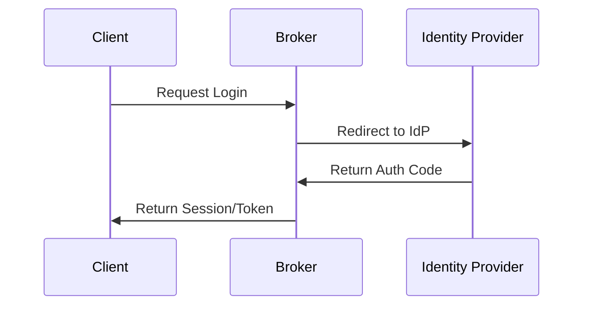

# OAuth Client <-> Identity Broker <-> Identity Provider Demo

## Overview

### Context

This project is a demo for the authentication flow my team partner and I recommended for an in-house project during my time at an internship, where the goal was to research possible solutions for an SSO system using multiple identity providers. A key aspect was to make it as simple as possible to add more service providers as well as identity providers as needs evolve.

### Architecture

The demo is built using [Svelte](https://svelte.dev/) for the client and [better-auth](https://better-auth.com/) for the identity broker. For simplicity, the client and the identity broker are built in the same repository.

GitHub is used as the identity provider in this demo. However, better-auth supports multiple identity providers, making it suitable to act as the identity broker for service providers that might make use of multiple identity providers at the same time.

With the current implementation, adding a new identity provider is simply a matter of registering the provider in the identity broker and adding the necessary environment variables, as well as dealing with any configurations needed on the identity provider side (usually a callback URL). Adding a new service provider requires you to add the service to the broker's trusted origins list as well as to a database table containing the service provider's Client ID, Client Secret, and Redirect URI.

### Scope

As this is a demo, it is not a production-ready solution. It focuses on the **authentication** (identifying the user) aspect rather than **authorization** (managing permissions) or user profile management. It does not establish a single source of truth for user claims but merely demonstrates the flow of identity verification. A common way to handle authorization (for a confidential client) is to use a database to store user claims and let the broker share those claims with the service provider, through a token. This is not implemented in this demo. But could be as simple as adding claims to the token(s) being exchanged.

See the Authorization document for some thoughts on how to handle authorization for public clients.

### Built with

- 
- 

### Setup

1. Clone the repository
2. Install dependencies: `npm i` for both the client and the identity broker.
3. Create a .env file in/for both the client and the identity broker.
4. For the demo, The broker needs:
    - BETTER_AUTH_SECRET (generated at better-auth)
    - BETTER_AUTH_URL (the base URL for your broker)
    - GITHUB_CLIENT_SECRET (both this and client id can be created easily with GitHubs dev tools)
    - GITHUB_CLIENT_ID
    - PRIVATE_KEY_JWK
      
And if you want to try the demo out the gate with MS SQL, add these as well with your information:

    - MSSQL_SERVER
    - MSSQL_DATABASE
    - MSSQL_PORT
    - MSSQL_USER
    - MSSQL_PASSWORD
5. For the demo, the client needs:
   - CLIENT_ID
   - CLIENT_SECRET
   - REDIRECT_URI (Where the broker should be doing callbacks)
   - BROKER_URL (at what URL the broker exists)
6. in the lib/dataAccess/db_schema.sql file, SQL commands for creating the required oauth tables exists. Run them against your database.
7. Run `npx @better-auth/cli generate` and `npx @better-auth/cli migrate` to generate and migrate the required better-auth tables.
